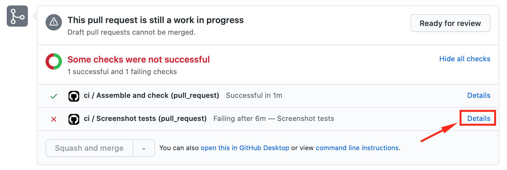
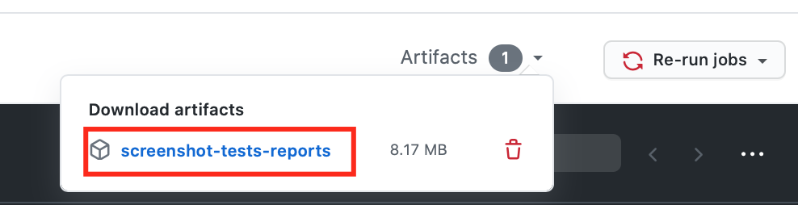

Screenshot tests
================

We're using [Shot](https://github.com/Karumi/Shot) for screenshot testing. Here is the guide how to work with it.

## On local (Your computer)

You can override existing screenshots with screenshots of your favorite device/emulator, if you're going to play with screenshot tests on your machine. To do so, start emulator or attach your device and execute `/scripts/record_screenshots.sh` script.

To run screenshot tests, use the following command:

```
./gradlew executeScreenshotTests
```

Do not forget to revert your screenshots in `git` before submitting PR, because CI will fail.

If you've added new screenshot tests, you'll have to add screenshots for those tests, so CI will pass. Currently, there is no simple way to do so locally. Please, refer to next section for more info how to do it.

## On Remote (Github)

If you faced problems with screenshot tests, first of all, you need to download report about what went wrong. You can do it the following way (assuming, that PR is already created and submitted):

1) Open PR page on Github.

2) Click "Details" button on failed Github Actions Workflow:


3) Click on "Artifacts" dropdown and select `screenshot-tests-reports`:


4) In downloaded archive, select and open `index.html`. You should see report with detailed explanation about tests.

5) (Optional) If some screenshots are missing, you can copy those screenshots from `/images/` directory and paste them to `{projectDir}/library/screenshots/debug/` directory (there are all baseline screenshots are stored). Make sure, that those screenshots are correct, so tests will pass!